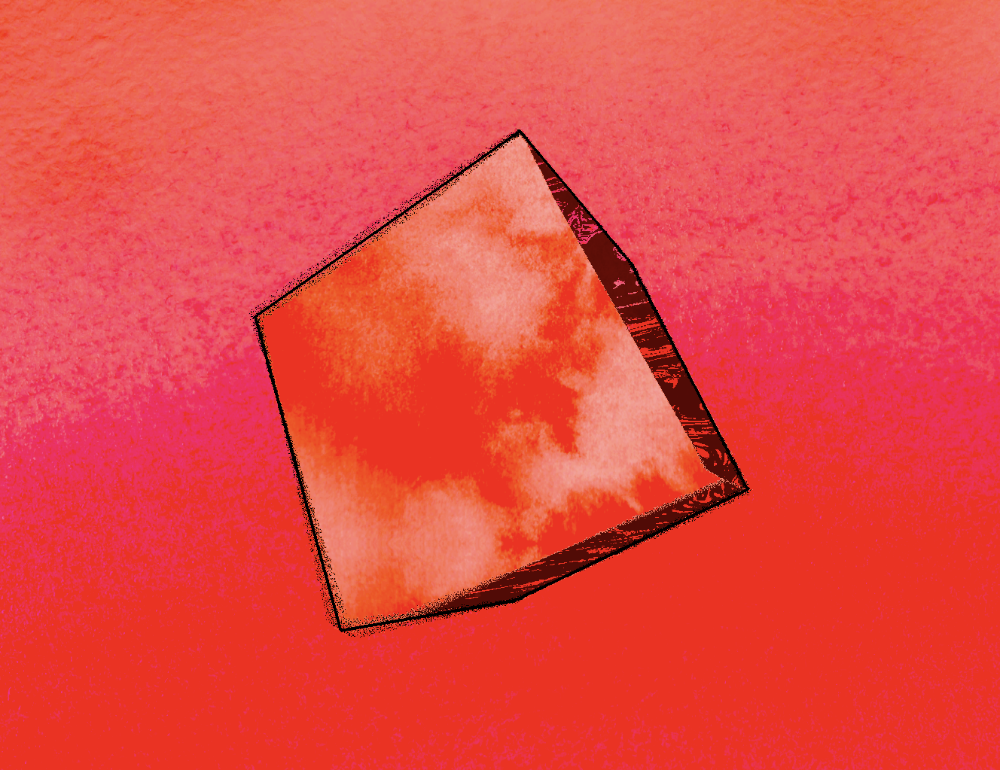

# Unity-Dream-Shader-
This shader is my creative interpretation of what our mind looks like.  

## Limitation ##
This SHADER is rendered in Unity 6 (6000.0.35f) and uses the built-in render pipeline. 

## Tips ##
- try out different textures!
- try a different output color, (see pass three)
- As things stand, each if statement/ifelse/else statement is a different tone that produces a unique color or mapped textures. Therefore, add or remove if statement to gain or lesses posterized colors.
-change fidelity of textures by multiplying uv coords. This is pretty important for noise textures.

## Credit ##
-If you want to use this shader for your game or have some other use of it... it would be an honour. 🥹
